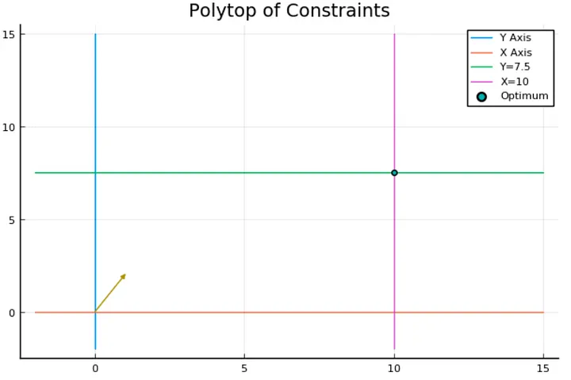

Some basics of Linear/Mixed Integer Programming & How to use a heuristic callback inside a MIP solver.  

## Introduction

One of the primary purposes of the computer sciences and operation research is to solve problems efficiently; problem-solving is a field where we often find very “ad-hoc” methods of resolution, they can be efficient, but they rely on some specific properties of the problem which are not necessarily easy to notice.

In this series of posts, we will introduce and discover a very versatile and generic way of thinking and of solving a wide variety of problems, and this introduction will occur on three sides:

- On the theoretical view, we will investigate how Linear Programming and Mixed Integer Programming can help us in modelling big combinatorial problems.
- In the practical aspect, we will see how we can use an API to instantiate a Linear Program and exploit some of the problems we solve to improve the solving procedure's efficiency.
- And finally, from the operational perspective, we will discover a very recent, efficient and user-friendly language: Julia, and more precisely, we will discover a library: JuMP, a domain-specific modelling language for [mathematical optimization](https://en.wikipedia.org/wiki/Mathematical_optimization).

This series of posts doesn't assume a background in Julia; I think a Python background is more than enough to understand the pieces of code I will use.

## What is this post about

This post is the pilot of the series, but it will also be the starting point of it by giving you the background you will need to understand the practical techniques that can be used to solve large combinatorial problems.

It will also be the only post in which we will present a pure theoretical academic problem as an application for simplicity.

Still, if you are comfortable with mixed-integer programming, this post (and more generally this series) is a good occasion to see to use Julia and, more precisely, **how to tune your exact solving procedure with some approached methods**.

---


## Smooth introduction to Linear Programming (and to Julia)

Let’s start by presenting how a linear program is structured and how a solver will perform a resolution. To do it, we will go through a simple example.

To make it visualizable, we will take an example where we will try to optimize a linear function of two variables with respect to a set of linear constraints.

$$
\begin{align*}
\text{max} \quad & x + 2y \\
\text{Subject to} \quad & x \leq 10.0 \\
& y \leq 7.5 \\
& x \geq 0.0 \\
& y \geq 0.0
\end{align*}
$$

Geometrically, if we take each constraint and replace the inequality with equality, each constraint will be a line equation. This line will separate R² into two parts and invalidate one of them according to the direction of the inequality.

We will name the polyhedron delimited by the set of constraints, which is, in this case, a polytope because it’s close and bounded, the polyhedron (or the polytope) of constraints.

As a warm-up to Julia, let’s see how we can draw the polytope of constraints by using plot.jl, a “matplotlib-like” framework and the Package LinearAlgebra is similar to NumPy.

First, we use Pkg, which is the built-in package manager of Julia, to add the required Packages,

```julia
using Pkg;
Pkg.add("LinearAlgebra");
Pkg.add("Plots");
Pkg.add("PyPlot");
```

After adding them, we can import them.

```julia
using LinearAlgebra
using Plots
pyplot()
```

The last line aims to complete some package plot functionalities for visualization (check the doc here for more details).

An easy way to draw any function is to sample points and compute the associated images, and this can be done in Julia the following way :

```julia
x_v = LinRange(-2,15,100)
plot([x_v], [x_v .+ 7.5], label ="Y=x + 7.5")
plot!([x_v], [-2x_v .+ 20], label ="Y= -2x + 20")
```

The first line will sample 100 points from the interval [-2, 15]; a part of this; you have several things to notice :

- “plot” is used to create a line plot and plot! update a created plot.
- “.+” is the element-wise equivalent of the vector addition.
- Julia is so handy that omitting the “\*” between a coefficient and a variable is possible even with a vector.

These lines will produce the following plot :


and now let’s print the polytope of constraints :

```julia
x_v = LinRange(-2,15,100)
y_v = LinRange(-2,15,100)
plot([0*x_v], [y_v],label ="Y Axis")
plot!([x_v], [0*x_v],label ="X Axis")
plot!([x_v], [0*x_v .+ 7.5], label ="Y=7.5")
plot!([0*x_v .+ 10], [y_v],label ="X=10")
plot!(title = "Polytop of Constraints")
```


The grey area I added to the plot represents the space's portion, which satisfies the problem's constraints.

Now let’s focus on the objective function by looking at the vector (1,2), representing the gradient of the linear function x+2y.


Each line I added represents a line of points with the same value. The further you go in the gradient direction, the bigger the objective value becomes.

We can visually conclude that the best solution is at the intersection of the green and the pink line, so let’s see if we find this result using JuMP.

The traditional add/import lines (we will use GLPK as a solver, but nothing is dependant on it).

```julia
Pkg.add("JuMP")
Pkg.add("GLPK")
using JuMP
using GLPK
```

Now we declare our model and set the optimizer from GLPK:

```julia
prgrm = Model()
set_optimizer(prgrm, GLPK.Optimizer)
```

We add the variables and precise their scope; by default, the variables are continuous :

```julia
@variable(prgrm, 0<=x)
@variable(prgrm, 0<=y)
```

Now we create and add the two remaining constraints; the first two are in the scope of the variables;

```julia
@constraint(prgrm, x <= 10)
@constraint(prgrm, y <= 7.5)
```

Finally, we add the objective function and precise sense of optimization, which will be, in this case, a maximization :

```julia
@objective(prgrm, Max, x+2y)
```

One interesting feature of JuMP and especially when using it with Jupyter-notebook is that we can print the program as easily as the content of any variable, which gives us the following output :


And now solving it is as easy to say as it is to do :

```julia
optimize!(prgrm)
```

After that, we can access the values of the variables after optimization like this:

```julia
value.(x)
value.(y)
```

And so one we can update our precedent plot to confirm our graphical resolution with the line :

```julia
plot!([value.(x)], [value.(y)], seriestype = :scatter, label="Optimum")
```

This gives us :



## The Simplex principle

Solving a linear program is done with the Simplex algorithm, which works because of a simple but important principle :

> Optimizing a linear function on a polytope (or more generally a compact convex space) always leads us to a vertex (more generally an extreme point).