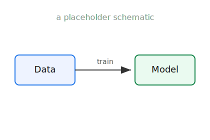
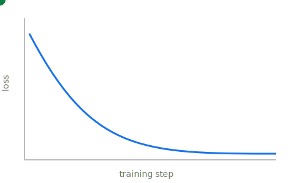

<!--
  A slide deck written in PURE MARKDOWN, compiled by generate.py.

    • New slide        : a line with only   ---
    • Sub-slide (down)  : a line with only   --
    • Speaker notes     : a line that is just  Note:   (text after it = notes)
    • Reveal on click   : add  {: .fragment}  to a bullet
    • Slide background  : <!- - .slide: data-background="#0b3d2e" - ->  at the top

  Save the file → the watcher rebuilds → refresh the browser.
  (For a horizontal rule INSIDE a slide use ***  — never --- .)
-->

# Building Talks in the Browser

#### A placeholder presentation

Ouaguenouni Mohamed

Use `←` / `→` (or Space) to move · press `S` for speaker view

Note:
This is a speaker note — only you see it in the speaker view (press **S**).
It gives you notes, a timer, and a preview of the next slide.

---

## Why not Beamer?

- Slides are **Markdown**, not LaTeX boilerplate
- **Save → refresh**, no `pdflatex` round-trip
- Real **LaTeX math** still works: $e^{i\pi} + 1 = 0$
- Code highlighting, images, tables, web embeds
- One keystroke to **export a PDF** handout

Note:
The math uses the exact same dollar-sign delimiters as your articles, and is
compiled with the same pipeline — so anything you wrote in KaTeX pastes straight in.

---

## Driving the talk

| Key | Action |
|-----|--------|
| `→` / `Space` | Next step / slide |
| `←` | Previous |
| `S` | Speaker view (notes + timer) |
| `O` | Overview of every slide |
| `F` | Fullscreen · `Esc` to exit |
| `B` | Black / pause the screen |

---

## Bullets that build

Add `{: .fragment}` to reveal a bullet on click — this is Beamer's
`\pause` / `\onslide`:

- First this appears {: .fragment}
- then this {: .fragment}
- finally this {: .fragment}

Note:
Each `→` reveals the next fragment, then moves on to the following slide.

---

## Math, like in your papers

Inline — the gradient step is
$\theta_{t+1} = \theta_t - \eta\,\nabla L(\theta_t)$.

A display equation:

$$
\mathbb{E}_{x \sim p}\big[\,f(x)\,\big]
  = \int_{\mathcal{X}} f(x)\, p(x)\, \mathrm{d}x
$$

---

## Multi-line math

`aligned` environments work just like in LaTeX:

$$
\begin{aligned}
\max_{x} \quad & c^{\top} x \\
\text{s.t.} \quad & A x \le b \\
                  & x \ge 0
\end{aligned}
$$

---

## Code, highlighted

```python
def softmax(z):
    z = z - z.max()          # numerical stability
    e = np.exp(z)
    return e / e.sum()

print(softmax(np.array([2.0, 1.0, 0.1])))
```

Fenced code blocks are highlighted automatically (here: Python).

---

## Two columns

<div class="columns" markdown="1">
<div markdown="1">

**Text on the left**

- Idea or claim
- A second point
- A plain HTML grid

</div>
<div markdown="1">



</div>
</div>

---

## Figures

<figure>

<figcaption style="color:#666; font-size:0.6em">Figure 1 — any PNG / JPG / SVG, sized with CSS.</figcaption>
</figure>

Drop the file in the talk folder, then ``.

---

## Animation in a figure



Animated **SVG**, **GIF** and **video** play right in the slide.
A clip autoplays on entry with `<video data-autoplay src="clip.mp4">`.

---

## Interactive figures

The same `:::html` embed your articles use works here too — a live Plotly /
D3 / canvas widget, hoverable on the slide:

:::html plot.html :::

---

<!-- .slide: data-auto-animate -->

## Auto-Animate

<div data-id="ball" style="width:120px; height:120px; background:#1a73e8; border-radius:50%; margin:2.5rem auto;"></div>

Give matching elements a `data-id` — they **morph** between slides. Press `→`.

---

<!-- .slide: data-auto-animate -->

## Auto-Animate

<div data-id="ball" style="width:320px; height:320px; background:#0b8043; border-radius:50%; margin:2.5rem auto;"></div>

Build a diagram or equation step by step — this replaces Beamer overlays.

---

<!-- .slide: data-background="#0b3d2e" -->

## Section dividers

This slide has a dark background, set with a one-line comment at the top of
the slide:

`<!-- .slide: data-background="#0b3d2e" -->`

Great for separating the parts of a talk.

---

## Vertical slides for depth

Press `↓` to drill into detail, or `→` to skip the whole section.

--

### Backup detail 1

Stacking slides vertically keeps optional material (proofs, backup, Q&A)
out of the main left-to-right flow.

--

### Backup detail 2

`↑` goes back up · `→` continues the main thread.

---

## Quotes

> Everything should be made as simple as possible, but not simpler.

A normal Markdown blockquote.

---

# Thank you

Questions?

[ouaguenouni.hachemi@gmail.com](mailto:ouaguenouni.hachemi@gmail.com)

Note:
To export this deck to PDF, add ?print-pdf to the URL and use the browser's
"Save as PDF". See PRESENTATIONS.md for details.
